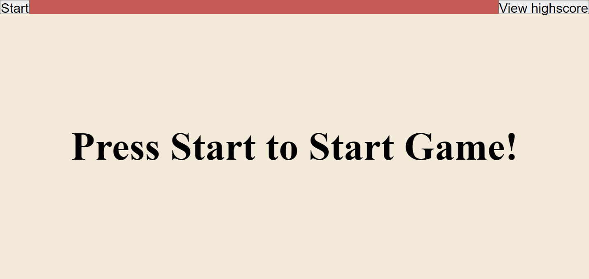
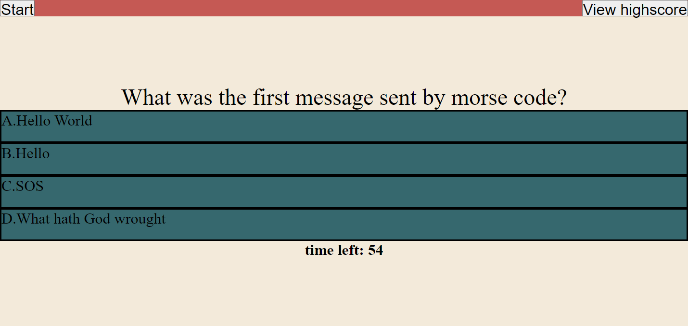
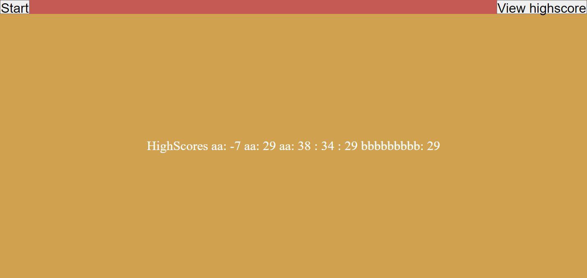
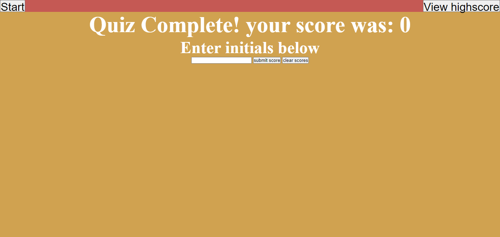

# Trivia Quiz
## Description

This project provides a website to take a trivia quiz. The user will be able to press a start button to start the timed quiz and then click on the provided answers and will then be presented with another question. At the end of the quiz the user will be able to input thier score and save it to a highscore in local storage so they can come back later and look at thier scores.

## Installation
N/A

## Usage
check out the deployed website here!: https://ian-danas.github.io/Trivia-Quiz/

To use this website the user can either select start to start the quiz or select highscores. If the user selects highscores they will be presented with a highscore leaderboard to see scores from previous attempts. From their they can start the game and the questions will popup along with multiple choice answers they can click on. The quiz is timed and every wrong answer 5 seconds is subtracted from the timer. At the end of the quiz the current time on the timer will be thier score. Once the last question is answered a new display will come up with a place to enter in initials and once submitted the user will be able to see the leaderboard. From this display they are also able to clear the leaderboard which will remove the scores from the local storage. Then the user can play the game again by hitting start again or go to the leaderboard. Once start game is pressed they will not be able to start a new game or view the highscores until the game is over.

## Credits
trivia questions found on: https://www.today.com/life/inspiration/trivia-questions-rcna39101

## License
N/A